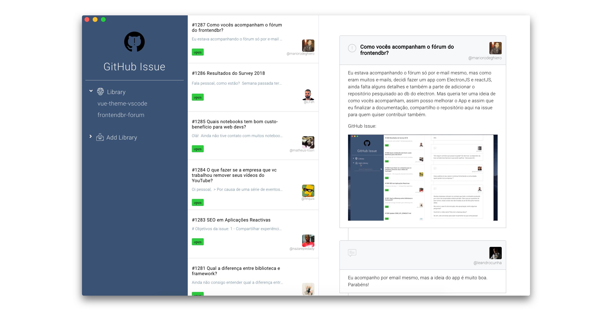

<div align="center">

 <h1>GitHub Issue </h1>

<p align="center">
    A Desktop App built with  <a href="http://electron.atom.io/">Electron</a> and <a href="https://facebook.github.io/react/">React</a> to be Cross-Platform to manage GitHub issues.
</p>

</div>

<div align="center">

[](https://github.com/mariorodeghiero/git-issue-react-electronjs/tags)
[](https://github.com/mariorodeghiero/git-issue-react-electronjs/issues?q=is%3Aopen+is%3Aissue+label%3Afeature-request+sort%3Areactions-%2B1-desc)
[](https://github.com/mariorodeghiero/git-issue-react-electronjs/issues?utf8=✓&q=is%3Aissue+is%3Aopen+label%3Abug)
[](http://opensource.org/licenses/MIT)

</div>

<div align="center">


<!--  -->

</div>

## Built With

- [ReactJS](https://reactjs.org) - ReactJS
- [ElectronJS](https://electronjs.org) - ElectronJS
- [electron-react-boilerplate](https://github.com/chentsulin/electron-react-boilerplate) - electron-react-boilerplate

## Prerequisites

- **Requires a node version >= 7 and an npm version >= 4.**
- **If you have installation or compilation issues with this project, please see [debugging guide](https://github.com/electron-react-boilerplate/electron-react-boilerplate/issues/400)**

## Install

First, clone the repo via git:

```bash
git clone --depth=1 https://github.com/mariorodeghiero/git-issue-react-electronjs.git your-project-name
```

And then install dependencies with yarn.

```bash
$ cd your-project-name
$ yarn
```

**Note**: If you can't use [yarn](https://github.com/yarnpkg/yarn), run `npm install`.

## Run

Start the app in the `dev` environment:

```
$ yarn dev
```

OR

```bash
$ npm run dev
```

## Packaging

You can debug your production build with devtools by simply setting the DEBUG_PROD env variable:

```
$ DEBUG_PROD=true yarn package
```

To package apps for the local platform:

```bash
$ npm run package
```

To package apps for all platforms:

First, refer to [Multi Platform Build](https://www.electron.build/multi-platform-build) for dependencies.

Then,

```bash
$ npm run package-all
```

To package apps with options:

```bash
$ npm run package -- --[option]
```

To improve the usability of this App, you can create keyboard shortcuts to start quickly.

- For Mac_OS use "Automator".
- For Windows access "Properties" of the App.

## Contributing

Please read [CONTRIBUTING.md](CONTRIBUTING.md) for details on our code of conduct, and the process for submitting pull requests to us.

## Author

- [Mário Antônio do Amaral Rodeghiero](https://github.com/mariorodeghiero)

## Contributors

| [](https://github.com/mariorodeghiero) |
| --------------------------------------------------------------------------------------------------------------------- |


| [Mário Rodeghiero](https://github.com/mariorodeghiero)

## License

This project is licensed under the MIT License - see the [LICENSE.md](LICENSE.md) file for details
